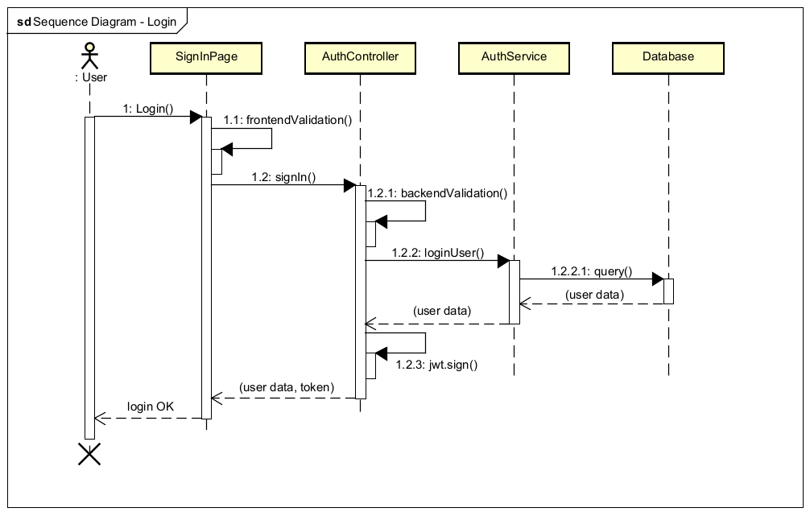
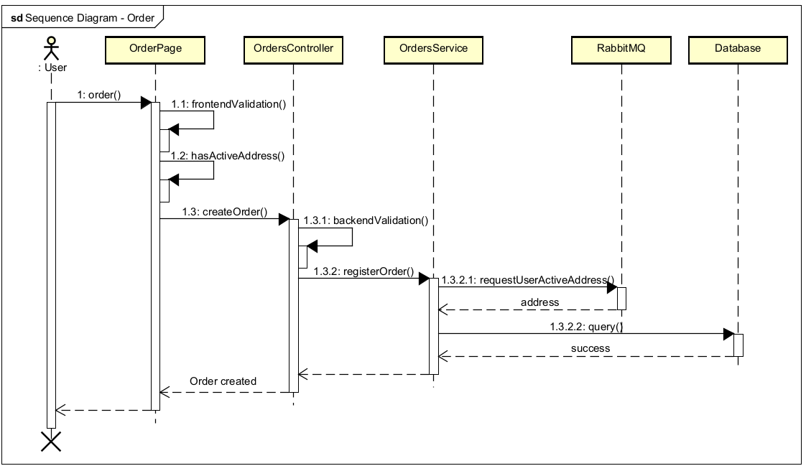
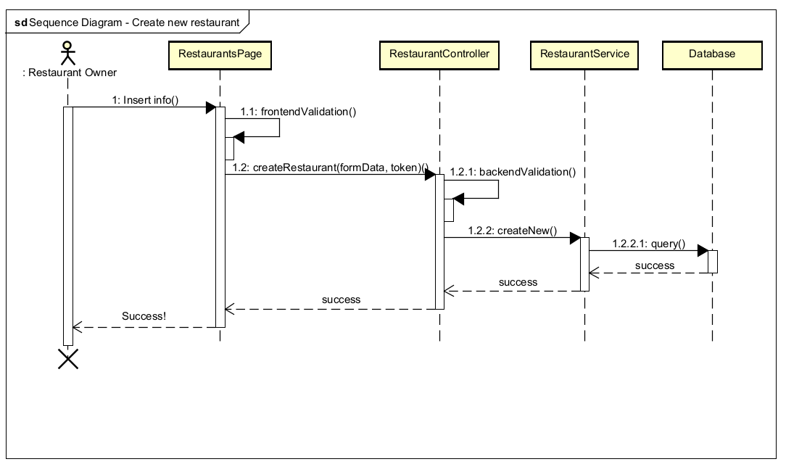
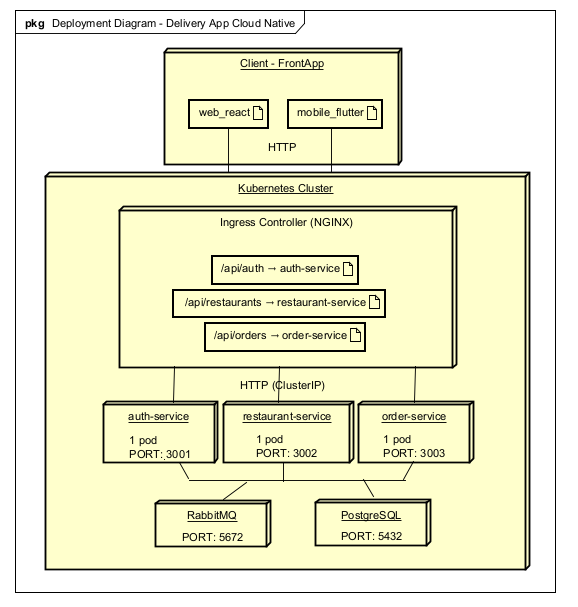
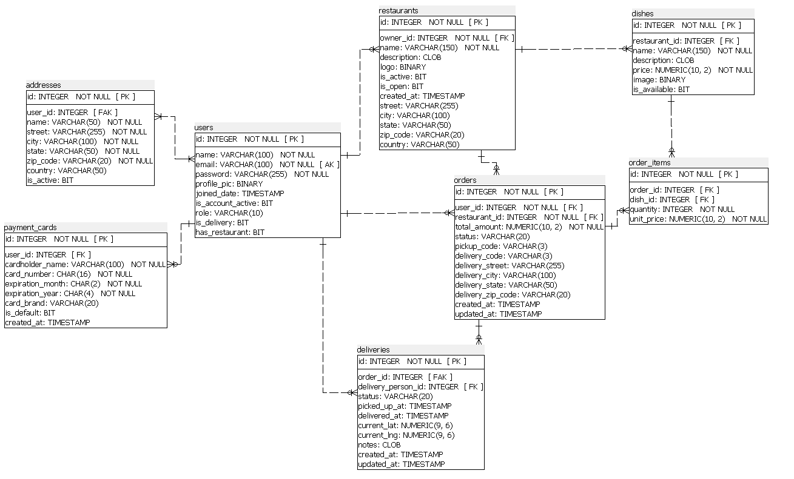

# Delivery-App-Cloud-Native

Microserviços • Docker Swarm + Kubernetes • PostgreSQL • RabbitMQ • React + Flutter

## Índice

- [Visão Geral da Arquitetura](#visão-geral-da-arquitetura)
- [Tecnologias Utilizadas e Decisões de Arquitetura](#tecnologias-utilizadas)
- [Estrutura de Pastas](#estrutura-de-pastas)
- [Como Rodar o Projeto](#como-rodar-o-projeto)
- [To-Do List / Próximos Passos](#to-do-list--próximos-passos--evolução-do-projeto)
- [Demonstração do Projeto](#demonstração-do-projeto)
- [Diagramas UML](#diagramas-uml)
- [Modelo de Dados](#modelo-de-dados-diagrama-er)

Projeto de **aplicativo de delivery cloud-native**, desenvolvido com foco em **arquitetura moderna**, **escalabilidade**, **segurança** e **boas práticas de engenharia de software**, simulando um cenário real de produção utilizado por empresas de médio e grande porte.

O sistema foi projetado utilizando **microserviços**, **comunicação assíncrona**, **containerização**, **orquestração**, **automação de infraestrutura** e **validações robustas**, cobrindo desde backend até frontend web e mobile.

---

## Visão Geral da Arquitetura

O projeto segue uma **arquitetura de microserviços desacoplados**, cada um com responsabilidade bem definida, comunicando-se de forma **assíncrona** via **mensageria**.

### Microserviços Backend
- **auth-service** → autenticação, autorização e emissão de JWT
- **restaurant-service** → gestão de restaurantes e cardápios
- **order-service** → criação e acompanhamento de pedidos

Cada serviço segue o padrão **MVC**, com:
- Controllers (camada HTTP)
- Services (regras de negócio)
- Models (acesso a dados)

---

## Tecnologias Utilizadas

### Backend
- Node.js
- JWT (JSON Web Token)
- Joi (validação de dados)
- PostgreSQL
- RabbitMQ
- Docker
- Docker Swarm
- Kubernetes

### Frontend
- React + Vite (Web)
- Flutter (Mobile)
- Bootstrap

### Infraestrutura & DevOps
- Docker Swarm Secrets
- Kubernetes Deployments e Services
- Bash Scripts para automação
- Init SQL para versionamento do banco

### Health Checks (Liveness & Readiness)
Cada serviço expõe o endpoint GET /health que valida:

- O status do processo.

- Uptime: Tempo de atividade do processo.


### Resumo das portas utilizadas
| Serviço               | Porta Host | Porta Container |
|-----------------------|------------|-----------------|
| Frontend React	      | 8080    	 | 80              |
| Frontend Flutter	    | 8081	     | 80              |
| Auth Service          | 3001       | 3001            |
| Restaurant Service    | 3002       | 3002            |
| Order Service         | 3003       | 3003            |
| PostgreSQL            | 5432       | 5432            |
| RabbitMQ (Broker)     | 5672       | 5672            |
| RabbitMQ (Painel)     | 15672      | 15672           |

---

## Estrutura de Pastas

```text
backend/
 ├── auth-service/
 ├── restaurant-service/
 └── order-service/

front-apps/
 ├── web_react/
 └── mobile_flutter/

infra/
 ├── bin/
 │   └── create-db.sh
 │
 ├── db/
 │   └── init.sql
 │
 ├── k8s/
 │   ├── apps/
 │   │   ├── auth-deployment.yaml
 │   │   ├── restaurant-deployment.yaml
 │   │   ├── order-deployment.yaml
 │   │   └── frontends.yaml
 │   │
 │   ├── infrastructure/
 │   │   ├── postgres-deployment.yaml
 │   │   └── rabbitmq-deployment.yaml
 │   │
 │   ├── configmap.yaml
 │   ├── ingress.yaml
 │   ├── namespace.yaml
 │   ├── secret.yaml
 │
 └── scripts/
     ├── build-images.sh
     ├── deploy.sh
     ├── cleanup.sh
     └── monitor.sh
```

## Segurança e Autenticação

- Autenticação baseada em JWT  
- Tokens stateless, facilitando escalabilidade horizontal  
- Secrets armazenados via Docker Swarm Secrets  
- Nenhuma credencial sensível versionada no código  

### Benefício empresarial:

- Escalabilidade  
- Segurança  
- Compatibilidade com múltiplos clientes (Web e Mobile)  

---

## Por que RabbitMQ e não Kafka?

A escolha do RabbitMQ foi feita considerando o escopo do projeto e o tipo de problema resolvido.

### RabbitMQ

- Ideal para eventos de negócio  
- Baixa latência  
- Excelente para orquestração de workflows  
- Menor custo operacional  

### Kafka

- Mais indicado para streaming de grandes volumes de dados  
- Overhead e complexidade maiores  
- Desnecessário para este cenário transacional  

### Decisão técnica

RabbitMQ atende melhor aplicações de delivery, onde confiabilidade, simplicidade e consistência são prioritárias.

---

## Por que Microserviços?

- Escalabilidade independente por domínio  
- Isolamento de falhas  
- Facilidade de manutenção  
- Evolução contínua do sistema  

Microserviços não foram escolhidos por moda, mas para demonstrar domínio arquitetural e simular ambientes reais de produção.

---

## Por que PostgreSQL (Banco Relacional)?

- Consistência ACID  
- Relacionamentos bem definidos  
- Integridade dos dados  
- Ampla adoção no mercado  

Aplicações de delivery exigem transações confiáveis, algo fundamental em bancos relacionais.

---

## Validação de Dados

- Uso do Joi para validação de dados de entrada  
- Evita dados inválidos no sistema  
- Reduz falhas em produção  
- Garante previsibilidade das APIs  

---

## Automação e DevOps

Scripts Bash automatizam:

- Criação do banco de dados  
- Criação de secrets  
- Build das imagens Docker  
- Deploy em Docker Swarm e Kubernetes  
- Monitoramento dos serviços  

### Objetivo

Reduzir erro humano e garantir reprodutibilidade do ambiente.

---

## Docker Swarm e Kubernetes

- Docker Swarm: simplicidade e secrets nativos  
- Kubernetes: padrão de mercado, escalabilidade e alta disponibilidade  

O projeto suporta ambos, demonstrando flexibilidade e entendimento de ambientes reais.

## Como Rodar o Projeto

O projeto possui **scripts Bash** para automatizar todo o ciclo de build, deploy, monitoramento e encerramento da aplicação, reduzindo erros manuais e facilitando a execução em ambientes reais.

> **Pré-requisitos**
> - Docker instalado
> - Docker Swarm inicializado (`docker swarm init`)
> - Bash (Linux / WSL / macOS)
> - Portas necessárias liberadas

---

# Passo a passo para subir o ambiente

### 1- Build das imagens Docker

Responsável por construir todas as imagens dos microserviços e frontends.

```
bash infra/scripts/build-images.sh
```

### 2- Deploy da aplicação
Realiza o deploy completo da infraestrutura e dos serviços no Docker Swarm / Kubernetes (dependendo da configuração).
```bash
bash infra/scripts/deploy.sh
```

> Esse script:

> - Sobe banco de dados
> - Sobe RabbitMQ
> - Publica microserviços
> - Publica frontends

O Frontend React estará acessível em http://localhost:8080/
O Frontend Flutter estará acessível em http://localhost:8081/


### 3- Monitoramento (opcional)
Permite acompanhar o estado dos serviços durante e após o deploy.
```bash
bash infra/scripts/monitor.sh
```
> Útil para:

> - Verificar containers
> - Diagnosticar falhas
> - Acompanhar inicialização dos serviços


### 4- Criação das relações (primeira execução)
Executar o script que cria todas as relações necessárias no postgres:
```bash
bash infra/bin/create-db.sh
```

### 5- Encerrar a execução (cleanup)
Remove serviços, containers e recursos criados durante o deploy.
```bash
bash infra/scripts/cleanup.sh
```
> Recomendado para:

> - Finalizar testes
> - Limpar ambiente
> - Evitar consumo desnecessário de recursos


# To-Do List / Próximos Passos - Evolução do Projeto

Roadmap com foco em **escalabilidade**, **experiência do usuário** e **cenários reais de produção**

## Fundações & Correções Críticas

Nenhuma restante no momento.

## Prioridade Média-Alta - Segurança & Experiência do Usuário

1. **Autenticação e Recuperação de Conta**  
   - [ ] Login social (Google, Apple, Facebook?)  
   - [ ] Fluxo de recuperação de senha via e-mail  
     - Token temporário com expiração (ex: 15–30 min)  
     - Template de e-mail bonito e seguro  
   - [ ] Rate limiting no envio de e-mails de recuperação  
   - [ ] Auditoria de segurança (tabela de tokens, invalidação após uso)

2. **Sistema de Pagamentos**  
  - [ ] Integração com Stripe em modo Test (Sandbox)

## Prioridade Média – Features de Valor Percebido Alto

3. **Funcionalidades de Localização (GPS) – MVP**  
   - [ ] Mapa em tempo real no app do cliente  
     - Posição do entregador (já possui a latitude e longitude na tabela)
     - Posição estimada do restaurante → cliente  
   - [ ] Exibição de rota (polyline)  
   - [ ] Status visual do pedido (preparando, a caminho, entregue)  
   - Decisão técnica inicial:  
     - OpenStreetMap + Leaflet (grátis)  
     - ou Google Maps SDK (custo x qualidade)  

4. **Carrinho Multi-Restaurante**  
   - [ ] Permitir itens de múltiplos restaurantes no mesmo carrinho  
   - [ ] Regras de negócio a definir:  
     - Uma taxa de entrega única ou por restaurante?  
     - Checkout gera 1 pedido ou N pedidos vinculados?  
     - Como fica status e rastreamento?  

## Backlog - Melhorias & Otimizações Futuras

- Dark mode / temas no frontend  
- Internacionalização (i18n) – pelo menos pt-BR + en-US

# Demonstração do Projeto

Aqui estão algumas telas do sistema rodando:

[3–5 imagens aqui com  ou GitHub markdown]

# Diagramas UML


Diagrama de sequência - login



Diagrama de sequência - criar pedido



Diagrama de sequência - cadastrar restaurante



Diagrama de implementação/deploy


# Modelo de Dados (Diagrama ER)


Principais entidades e relacionamentos implementados no PostgreSQL.
